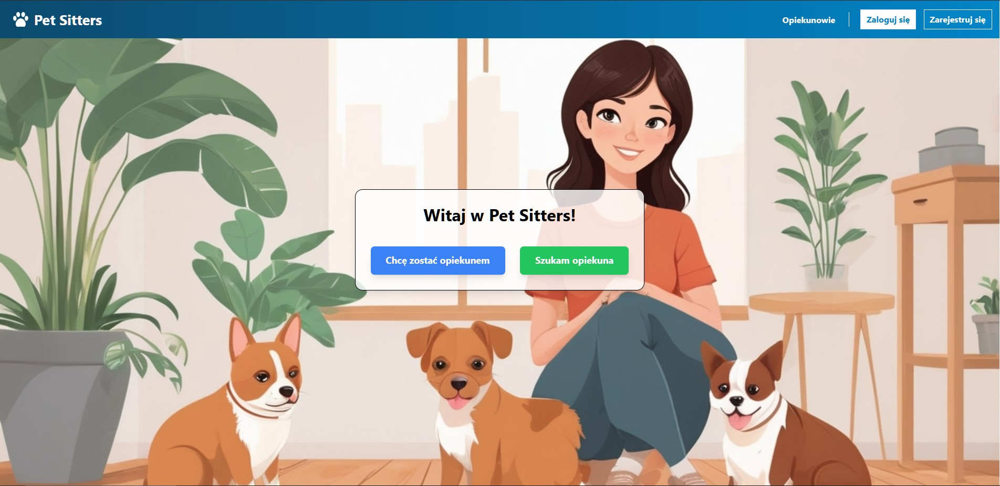
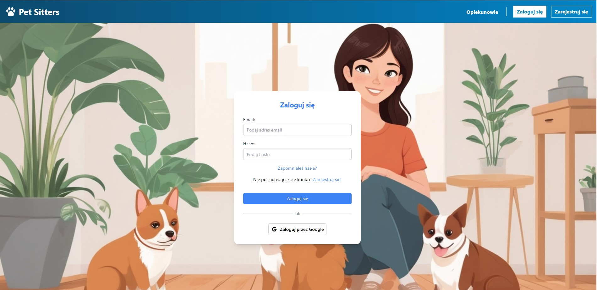
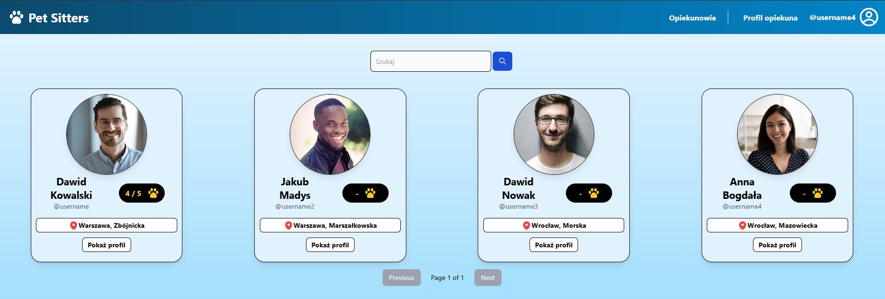
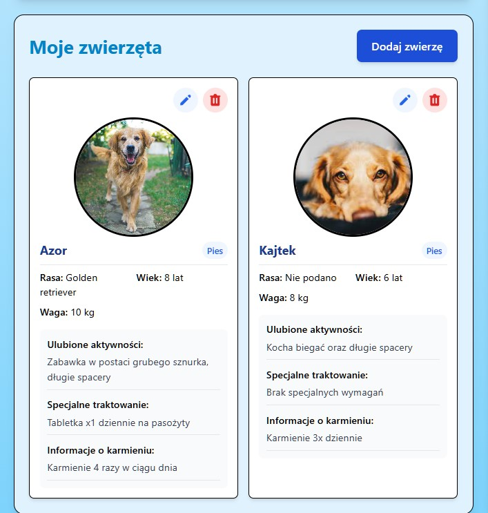
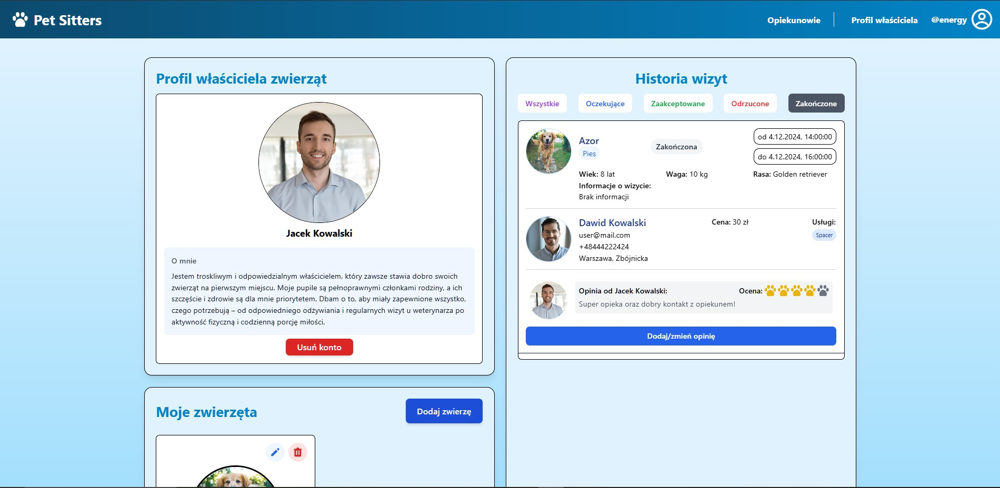
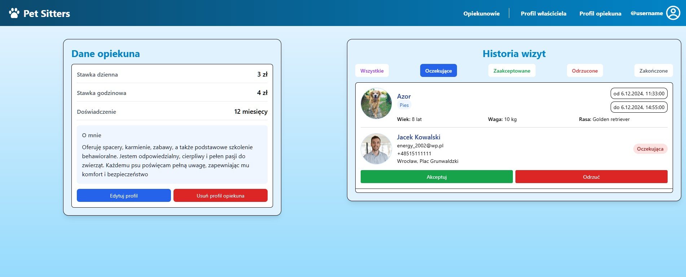

# PetSitters

A web application designed to enable pet owners to efficiently search for and book pet sitters.
The project addresses the challenges faced by individuals who are unable or lack the opportunity to care for their pets.
The application was built by using the :

- **Django** framework for Python on the server side,
- the **React** library along with the TailwindCSS framework on the client side,
- and the PostgreSQL relational database on **AWS**

As the production enviroment, a private VPS was used with HTTP server (**Nginx**) and WSGI (Web Server Gateway Interface) (**Gunicorn**).

## Images

